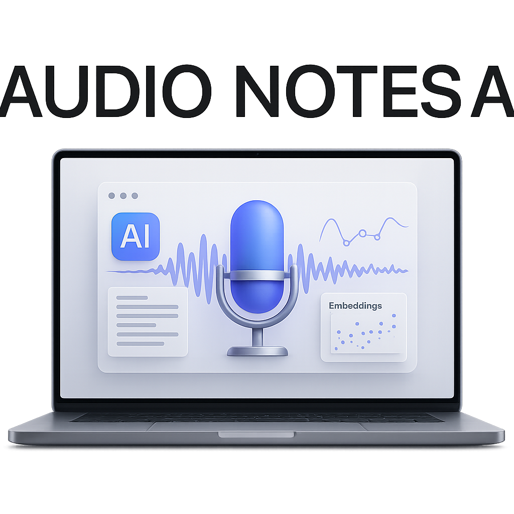
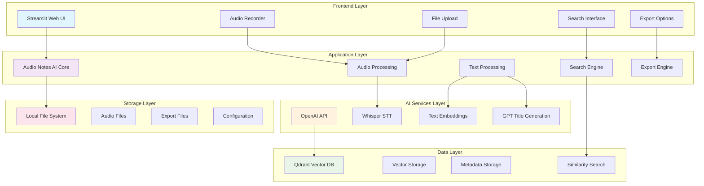

<p align="center">
  
</p>

<p align="center">
  
  
  
  
  
  
  
  
</p>

# 🎤 Audio Notes AI 🤖 - Enterprise Version 2.1.0

> **🎉 Wersja 2.1.0 dostępna!** 🎤 Audio Notes AI 🤖 Enterprise działa na Windows, macOS i Linux oraz oferuje intuicyjne zarządzanie kluczami API. Wszystkie funkcjonalności działają na każdym systemie operacyjnym.

---

## Opis
Zaawansowany system notatek głosowych z AI-powered wyszukiwaniem semantycznym. Nagrywaj, transkrybuj (Whisper), twórz wektory (embeddings) i wyszukuj notatki głosowe z pomocą sztucznej inteligencji. Funkcje: automatyczna kategoryzacja, tagowanie, eksport do TXT/PDF/DOCX, synchronizacja w chmurze. Nowoczesny, multiplatformowy interfejs (Windows, macOS, Linux). Rewolucja w organizacji wiedzy osobistej i biznesowej.

---

## Instalacja

```bash
   git clone https://github.com/AlanSteinbarth/Audio-Notes-AI.git
   cd Audio-Notes-AI
```

2. **Zainstaluj zależności**
   ```bash
   pip install -r requirements.txt
   ```

3. **Skonfiguruj zmienne środowiskowe**
   ```bash
   cp .env.example .env
   ```
   
   Edytuj plik `.env` i uzupełnij (klucz OpenAI jest opcjonalny):
   ```env
   # Opcjonalnie - można też podać w sidebarze aplikacji
   OPENAI_API_KEY=sk-twój-klucz-openai
   # Wymagane
   QDRANT_URL=https://twoja-instancja-qdrant.com
   QDRANT_API_KEY=twój-klucz-qdrant
   ```

4. **Uruchom aplikację**
   ```bash
   streamlit run app.py
   # lub
   python -m streamlit run app.py
   ```

5. **Podaj klucz OpenAI**
   - Jeśli nie masz klucza w `.env`, wprowadź go w sidebarze aplikacji
   - Klucz jest automatycznie weryfikowany przed użyciem

## 🛠️ Instalacja zależności systemowych

Aby aplikacja działała poprawnie na każdym systemie operacyjnym, wymagane są dodatkowe narzędzia systemowe:

- **ffmpeg** (do obsługi audio)
- **git** (do pobierania repozytorium i ewentualnych aktualizacji)

### Instalacja na macOS
```bash
brew install ffmpeg git
```

### Instalacja na Linux (Debian/Ubuntu)
```bash
sudo apt update
sudo apt install ffmpeg git
```

### Instalacja na Windows (z Chocolatey)
```powershell
choco install ffmpeg git
```

Jeśli nie masz Chocolatey, zobacz: https://chocolatey.org/install

---

## 📦 Instalacja bibliotek opcjonalnych

Niektóre funkcje wymagają dodatkowych bibliotek Python:

- **Nagrywanie audio w przeglądarce:**
  ```bash
  pip install streamlit-audiorecorder
  ```
- **Eksport PDF:**
  ```bash
  pip install fpdf
  ```

Aplikacja działa również bez tych bibliotek, ale niektóre funkcje będą niedostępne.

---

## 🧪 Środowiska wirtualne

Zalecamy korzystanie ze środowiska wirtualnego (venv lub conda):

### Python venv (uniwersalnie)
```bash
python -m venv venv
source venv/bin/activate  # macOS/Linux
venv\Scripts\activate    # Windows
pip install -r requirements.txt
```

### Conda (jeśli używasz)
```bash
conda create -n notatki python=3.11
conda activate notatki
pip install -r requirements.txt
```

---

## 🌍 Przenośność

Aplikacja została przetestowana na Windows, macOS i Linux. Wszystkie ścieżki plików oraz zależności są obsługiwane automatycznie. W przypadku brakujących zależności systemowych lub bibliotek Python, aplikacja wyświetli odpowiedni komunikat i instrukcję instalacji.

---

## 🛠️ Technologie

### Backend
- **Python 3.11+** - Język programowania
- **Streamlit** - Framework dla interfejsu webowego
- **OpenAI API** - Transkrypcja (Whisper) i embeddingi (text-embedding-3-large)
- **Qdrant** - Baza danych wektorowych

### Przetwarzanie
- **Whisper** - Transkrypcja audio na tekst
- **text-embedding-3-large** - Generowanie wektorów semantycznych
- **GPT-3.5** - Automatyczne generowanie tytułów

### Eksport
- **FPDF** - Generowanie dokumentów PDF
- **python-docx** - Tworzenie plików DOCX
- **Built-in** - Eksport do formatu TXT

## 📖 Jak używać

### 1. Dodawanie notatek
1. Kliknij "Nagraj notatkę" w zakładce "Dodaj notatkę"
2. Nagraj swoją notatkę głosową
3. Kliknij "Transkrybuj audio"
4. Sprawdź i edytuj transkrypcję w razie potrzeby
5. Kliknij "Zapisz notatkę"

### 2. Wyszukiwanie
1. Przejdź do zakładki "Wyszukaj notatkę"
2. Wpisz zapytanie (może być ogólne, np. "spotkanie z klientem")
3. System znajdzie semantycznie podobne notatki

### 3. Zarządzanie notatkami
1. W zakładce "Lista notatek" zobaczysz wszystkie zapisane notatki
2. Możesz edytować, usuwać lub eksportować każdą notatkę
3. Dostępne formaty eksportu: TXT, PDF, DOCX

## ⚙️ Konfiguracja

### Zmienne środowiskowe

| Zmienna | Opis | Przykład |
|---------|------|----------|
| `OPENAI_API_KEY` | Klucz API OpenAI | `sk-proj-...` |
| `QDRANT_URL` | URL instancji Qdrant | `https://xyz.qdrant.cloud:6333` |
| `QDRANT_API_KEY` | Klucz API Qdrant | `abc123...` |

### Modele OpenAI

- **Transkrypcja**: `whisper-1`
- **Embeddingi**: `text-embedding-3-large` (3072 wymiary)
- **Tytuły**: `gpt-3.5-turbo`

## 🏗️ Architektura



### Przepływ Danych

1. **Nagrywanie** → Audio → Streamlit UI
2. **Transkrypcja** → Audio → OpenAI Whisper → Tekst
3. **Embedding** → Tekst → OpenAI Embeddings → Wektor
4. **Zapis** → Wektor + Metadata → Qdrant DB
5. **Wyszukiwanie** → Query → Embedding → Similarity Search → Wyniki
6. **Eksport** → Dane → Generator → PDF/DOCX/TXT

## 🔧 Narzędzia diagnostyczne

Projekt zawiera zestaw narzędzi diagnostycznych dla deweloperów i administratorów:

### `quick_start.py` - Interaktywny przewodnik uruchamiania
```bash
python quick_start.py
```
- Sprawdza konfigurację środowiska
- Testuje połączenia API
- Uruchamia aplikację z przewodnikiem

### `diagnose_app.py` - Kompleksowa diagnostyka
```bash
python diagnose_app.py
```
- Analiza struktury projektu
- Weryfikacja importów i zależności
- Test połączeń zewnętrznych
- Sprawdzenie konfiguracji

### `test_app_simple.py` - Podstawowe testy
```bash
python test_app_simple.py
```
- Testy importów modułów
- Weryfikacja funkcji kluczowych
- Kontrola błędów składni

## 🤝 Współpraca

Chcesz przyczynić się do rozwoju projektu? Świetnie! Zobacz [CONTRIBUTING.md](CONTRIBUTING.md) dla szczegółów.

### Zgłaszanie błędów

Jeśli znalazłeś błąd, [utwórz issue](https://github.com/AlanSteinbarth/Audio-Notes-AI/issues) z:
- Opisem problemu
- Krokami do reprodukcji
- Informacjami o systemie

### Propozycje funkcji

Masz pomysł na nową funkcję? [Otwórz dyskusję](https://github.com/AlanSteinbarth/Audio-Notes-AI/discussions)!

## 📋 Roadmapa

- [ ] Obsługa wielu języków transkrypcji
- [ ] Kategorie i tagi notatek
- [ ] API REST dla integracji
- [ ] Aplikacja mobilna
- [ ] Backup i synchronizacja

## 🐛 Rozwiązywanie problemów

Szczegółowy przewodnik rozwiązywania problemów znajduje się w pliku [TROUBLESHOOTING.md](TROUBLESHOOTING.md).

### Najczęstsze problemy

#### Problem z streamlit-audiorecorder
```bash
# Błąd: No such component directory
pip uninstall streamlit-audiorecorder
pip install streamlit-audiorecorder --no-cache-dir --force-reinstall
```

#### Aplikacja działa bez nagrywania
Aplikacja automatycznie wykrywa dostępność bibliotek i:
- ✅ Pokazuje nagrywanie jeśli audiorecorder działa
- ✅ Pokazuje tylko upload plików jeśli audiorecorder nie działa
- ✅ Wszystkie funkcje działają niezależnie od nagrywania

## 📝 Changelog

Zobacz [CHANGELOG.md](CHANGELOG.md) dla pełnej historii zmian.

### Wersja 2.1.0 (2025-06-14) - UNIWERSALNA WERSJA
- ✅ **Pełna przenośność** - Natywne wsparcie Windows, macOS, Linux
- ✅ **Inteligentne API Key** - Klucz OpenAI w sidebarze lub .env
- ✅ **Automatyczna detekcja systemu** - Wykrywa brakujące zależności
- ✅ **Stabilny interfejs** - Naprawiono czarny ekran przy starcie
- ✅ **Odporne importy** - Elegancka obsługa opcjonalnych bibliotek

### Wersja 2.0.0 (2025-05-27) - ENTERPRISE
- Pierwsza stabilna wersja Enterprise
- Pełna funkcjonalność produkcyjna

## 📄 Licencja

Ten projekt jest licencjonowany na licencji MIT - zobacz plik [LICENSE](LICENSE) dla szczegółów.

## 👨‍💻 Autor

**Alan Steinbarth**
- Email: alan.steinbarth@gmail.com
- GitHub: [@AlanSteinbarth](https://github.com/AlanSteinbarth)

## 🙏 Podziękowania

- [OpenAI](https://openai.com) za API Whisper i GPT
- [Qdrant](https://qdrant.tech) za bazę danych wektorowych
- [Streamlit](https://streamlit.io) za framework UI
- Społeczność open source za inspirację

---

## 📸 Zrzuty ekranu
Poniżej przykładowe ekrany aplikacji (folder `Screenshots/`):

<p align="center">
  
</p>
<p align="center">
  
</p>
<p align="center">
  
</p>
<p align="center">
  
</p>
<p align="center">
  
</p>
<p align="center">
  
</p>

---

## 📊 Wydajność i Metryki

### Wydajność Systemu
- **Transkrypcja audio**: ~2-3x szybciej niż czas nagrania (dla plików do 10MB)
- **Wyszukiwanie semantyczne**: <200ms dla bazy do 10,000 notatek
- **Generowanie embeddingów**: ~1-2s dla tekstu do 1000 słów
- **Eksport dokumentów**: <1s dla notatek do 5000 słów

### Limity i Ograniczenia
- **Maksymalny rozmiar pliku audio**: 25MB (ograniczenie OpenAI)
- **Obsługiwane formaty audio**: MP3, WAV, FLAC, M4A, MP4
- **Maksymalna długość nagrania**: 10 minut (rekomendowane)
- **Jednoczesne użytkownicy**: Zależy od konfiguracji Qdrant i OpenAI API

### Zużycie Zasobów
- **RAM**: ~200-500MB (zależnie od rozmiaru bazy notatek)
- **Dysk**: ~50MB aplikacja + dane użytkownika
- **CPU**: Niskie zużycie (głównie I/O operacje)
- **Sieć**: Zależy od częstotliwości używania API

---

# 🐳 Docker & Konteneryzacja

### Szybkie uruchomienie z Docker
```bash
# Pobierz kod
git clone https://github.com/AlanSteinbarth/Audio-Notes-AI.git
cd Audio-Notes-AI

# Skopiuj i edytuj zmienne środowiskowe
cp .env.example .env
# Edytuj .env z kluczami API

# Uruchom z Docker Compose
docker-compose up -d

# Aplikacja dostępna na http://localhost:8501
```

### Budowanie własnego obrazu
```bash
# Zbuduj obraz
docker build -t audio-notes-ai:latest .

# Uruchom kontener
docker run -p 8501:8501 \
  -e OPENAI_API_KEY=your_key \
  -e QDRANT_URL=your_qdrant_url \
  -e QDRANT_API_KEY=your_qdrant_key \
  audio-notes-ai:latest
```

### Komponenty w Docker Compose
- **audio-notes-ai**: Główna aplikacja
- **qdrant**: Baza danych wektorowych
- **redis**: Cache (opcjonalny)

---

## 🛠️ Automatyczna Konfiguracja

### Skrypt Setup (Linux/macOS)
```bash
# Nadaj uprawnienia
chmod +x setup.sh

# Uruchom setup
./setup.sh
```

Skrypt automatycznie:
- ✅ Sprawdza Python i zależności systemowe
- ✅ Tworzy środowisko wirtualne
- ✅ Instaluje biblioteki Python
- ✅ Konfiguruje plik .env
- ✅ Tworzy niezbędne foldery
- ✅ Uruchamia podstawowe testy
- ✅ Opcjonalnie konfiguruje Docker

### Skrypt Setup (Windows)
```powershell
# Uruchom PowerShell jako Administrator
.\setup.ps1
```

---

## 📚 Dokumentacja API

Szczegółowa dokumentacja API znajduje się w pliku [API.md](API.md).

### Planowane API REST (v3.0.0)
- 🎤 **Audio Management**: Upload, transcribe, manage audio files
- 📝 **Notes CRUD**: Create, read, update, delete notes
- 🔍 **Semantic Search**: Advanced search with similarity scoring
- 📤 **Export**: PDF, DOCX, TXT export endpoints
- 🔐 **Authentication**: API keys, JWT tokens, OAuth 2.0

---

⭐ **Podobał Ci się projekt? Zostaw gwiazdkę!** ⭐